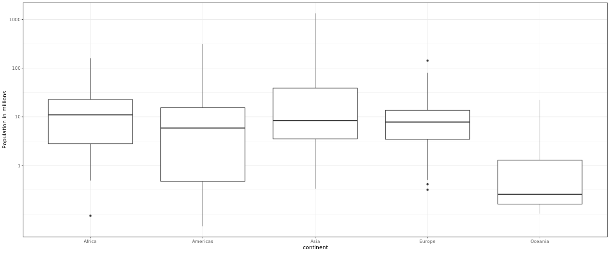

```{r setup, include=FALSE}
knitr::opts_chunk$set(echo = TRUE)
```

<br/>

## **Vector lengths**
When analyzing data it's often important to know the number of measurements you have for each category.

**Instructions**

- Define a variable ```male``` that contains the male heights.
- Define a variable ```female``` that contains the female heights.
- Report the length of each variable.

```{r, include=TRUE}
library(dslabs)
data(heights)
male <- heights$height[heights$sex=="Male"]
female <- heights$height[heights$sex=="Female"]
length(male)
length(female)
```

<br/>

## **Percentiles**
Suppose we can't make a plot and want to compare the distributions side by side. If the number of data points is large, listing all the numbers is inpractical. A more practical approach is to look at the percentiles. We can obtain percentiles using the ```quantile``` function like this

```
library(dslabs)
data(heights)
quantile(heights$height, seq(.01, 0.99, 0.01))
```

**Instructions**

- Create two five row vectors showing the 10th, 30th, 50th, 70th, and 90th percentiles for the heights of each sex called these vectors ```female_percentiles``` and ```male_percentiles```.
- Then create a data frame called ```df``` with these two vectors as columns. The column names should be ```female``` and ```male``` and should appear in that order. As an example consider that if you want a data frame to have column names ```names``` and ```grades```, in that order, you do it like this:

```
df <- data.frame(names = c("Jose", "Mary"), grades = c("B", "A"))
```
- Take a look at the ```df``` by printing it. This will provide some information on how male and female heights differ.

```{r, include=TRUE}
library(dslabs)
data(heights)
male <- heights$height[heights$sex=="Male"]
female <- heights$height[heights$sex=="Female"]

male_percentiles <- quantile(male, c(.1,.3,.5,.7,.9))
female_percentiles <- quantile(female, c(.1,.3,.5,.7,.9))

df <- data.frame(female = female_percentiles, male = male_percentiles)

print(df)
```

<br/>

## **Interpretating Boxplots - 1**
Study the boxplots summarizing the distributions of populations sizes by country.



Which continent has the country with the largest population size?

**Instructions**

Possible Answers

- Africa
- Americas
- Asia [X]
- Europe
- Oceania

<br/>

## **NInterpretating Boxplots - 2**
Study the boxplots summarizing the distributions of populations sizes by country.


Which continent has median country with the largest population?

**Instructions**

Possible Answers

- Africa [X]
- Americas
- Asia
- Europe
- Oceania

<br/>

## **Interpreting Boxplots - 3**
Again, look at the boxplots summarizing the distributions of populations sizes by country. To the nearest million, what is the ```median``` population size for Africa?


**Instructions**

Possible Answers

- 100 million
- 25 million
- 10 million [X]
- 5 million
- 1 million

<br/>

## **Low quantiles**
Examine the following boxplots and report approximately what proportion of countries in Europe have populations below 14 million:


Instructions

Possible Answers

- 0.75 [X]
- 0.50
- 0.25
- 0.01

<br/>

## **Interquantile Range (IQR)**
Based on the boxplot, if we use a log transformation, which continent shown below has the largest interquartile range?


**Instructions**

Possible Answers

- Africa
- Americas [X]
- Asia
- Europe
- Oceania