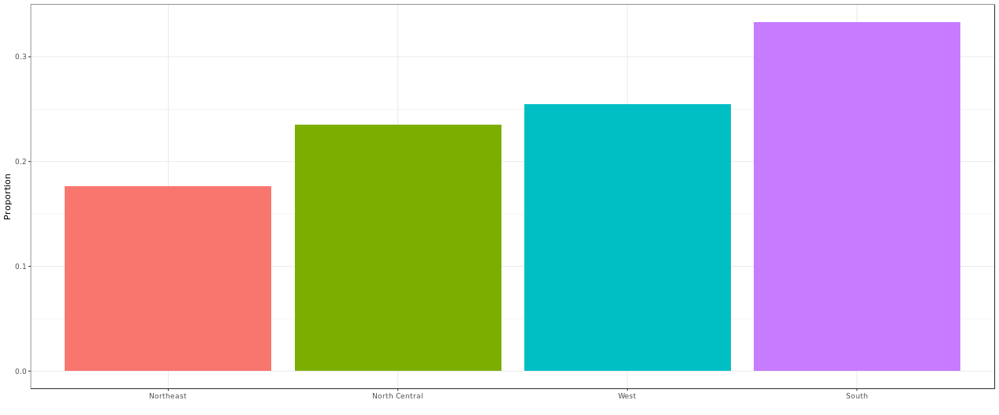
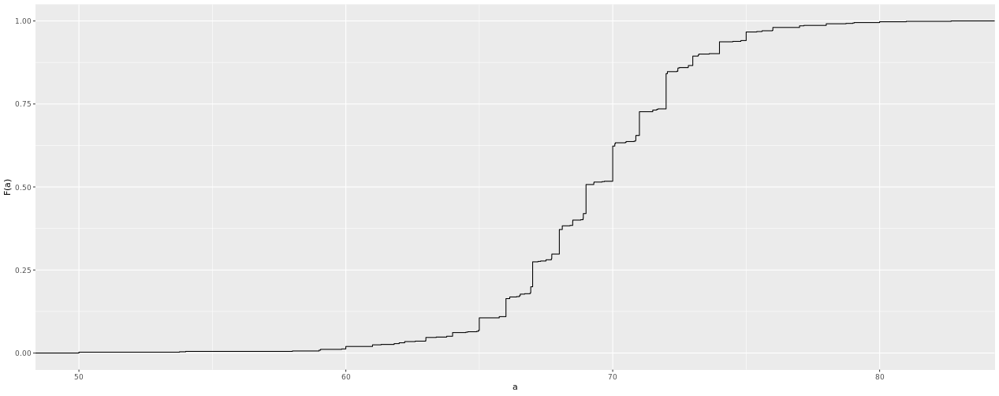
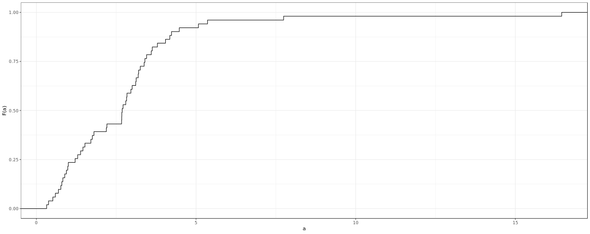
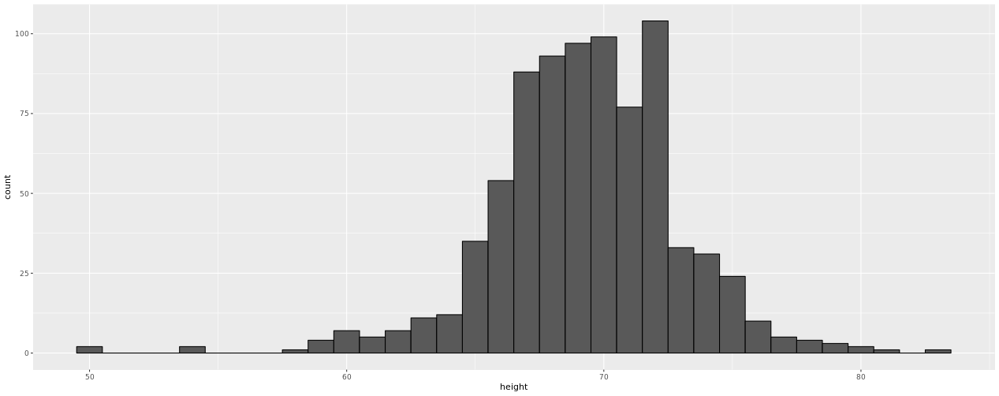
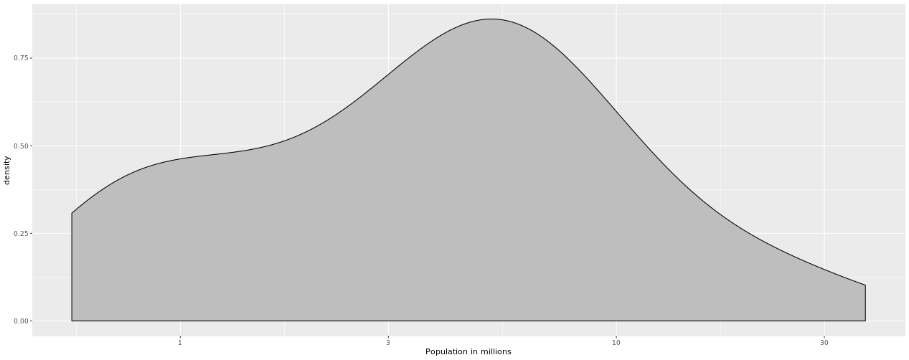
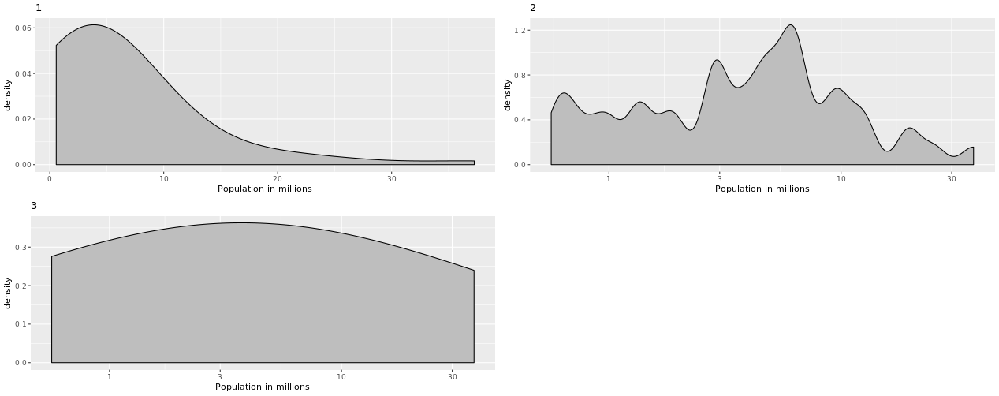

```{r setup, include=FALSE}
knitr::opts_chunk$set(echo = TRUE)
```

<br/>

## **Distributions - 1**

You may have noticed that numerical data is often summarized with the average value. For example, the quality of a high school is sometimes summarized with one number: the average score on a standardized test. Occasionally, a second number is reported: the standard deviation. So, for example, you might read a report stating that scores were 680 plus or minus 50 (the standard deviation). The report has summarized an entire vector of scores with with just two numbers. Is this appropriate? Is there any important piece of information that we are missing by only looking at this summary rather than the entire list? We are going to learn when these 2 numbers are enough and when we need more elaborate summaries and plots to describe the data.

Our first data visualization building block is learning to summarize lists of factors or numeric vectors. The most basic statistical summary of a list of objects or numbers is its distribution. Once a vector has been summarized as distribution, there are several data visualization techniques to effectively relay this information. In later assessments we will practice to write code for data visualization. Here we start with some multiple choice questions to test your understanding of distributions and related basic plots.

In the murders dataset, the region is a categorical variable and on the right you can see its distribution. To the closet 5%, what proportion of the states are in the North Central region?



Possible Answers

- 75%
- 50%
- 20% [X]
- 5%

## **Distributions - 2**

In the murders dataset, the region is a categorical variable and to the right is its distribution.

Which of the following is true:


Possible Answers

- The graph is a histogram.
- The graph shows only four numbers with a bar plot. [X]
- Categories are not numbers so it does not make sense to graph the distribution.
- The colors, not the height of the bars, describe the distribution.

## **Empirical Cumulative Distribution Function (eCDF)**

The plot shows the eCDF for male heights:



Based on the plot, what percentage of males are shorter than 75 inches?


Possible Answers

- 100%
- 95% [X]
- 80%
- 72 inches

## **eCDF Male Heights**

The plot shows the eCDF for male heights:


To the closest inch, what height m has the property that 1/2 of the male students are taller than m and 1/2 are shorter?

Possible Answers

- 61 inches
- 64 inches
- 69 inches [X]
- 74 inches

## **eCDF of Murder Rates**

Here is an eCDF of the murder rates across states.



Knowing that there are 51 states (counting DC) and based on this plot, how many states have murder rates larger than 10 per 100,000 people?

Possible Answers

- 1 [X]
- 5
- 10
- 50

## **eCDF of Murder Rates - 2**

Here is an eCDF of the murder rates across states:


Based on the eCDF above, which of the following statements are true:

Possible Answers

- About half the states have murder rates above 7 per 100,000 and the other half below.
- Most states have murder rates below 2 per 100,000.
- All the states have murder rates above 2 per 100,000.
- With the exception of 4 states, the murder rates are below 5 per 100,000. [X]

## **Histograms**

Here is a histogram of male heights in our heights dataset:



Based on this plot, how many males are between 62.5 and 65.5?

Possible Answers

- 5
- 24
- 44 [X]
- 100

## **Histograms - 2**

Here is a histogram of male heights in our heights dataset:


About what percentage are shorter than 60 inches?

Possible Answers

- 1% [X]
- 10%
- 25%
- 50%

## **Density plots**

Based on this density plot, about what proportion of US states have populations larger than 10 million?



Possible Answers

- 0.02
- 0.15 [X]
- 0.50
- 0.55

## **Density plots - 2**

Here are three density plots. Is it possible that they are from the same dataset? Which of the following statements is true:



Possible Answers

- It is impossible that they are from the same dataset.
- They are from the same dataset, but different due to code errors.
- They are the same dataset, but the first and second undersmooth and the third oversmooths.
- They are the same dataset, but the first is not in the log scale, the second undersmooths and the third oversmooths. [X]