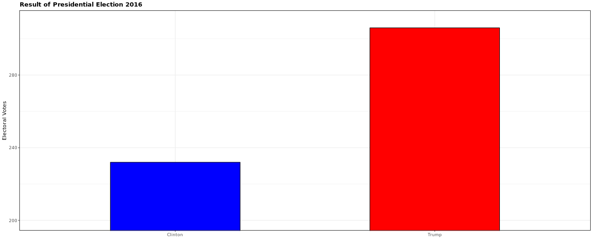
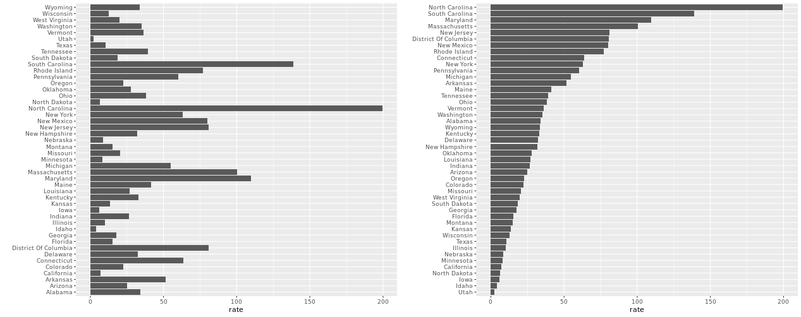

```{r setup, include=FALSE}
knitr::opts_chunk$set(echo = TRUE)
```

<br/>

#### **Customizing plots - Pie charts**
Pie charts are appropriate:

**Instructions**

Possible Answers

- When we want to display percentages.
- When ggplot2 is not available.
- When I am in a bakery.
- Never. Barplots and tables are always better. [X]

<br/>

#### **Customizing plots - What's wrong?**
What is the problem with this plot?



**Instructions**

Possible Answers

- The values are wrong. The final vote was 306 to 232.
- The axis does not start at 0. Judging by the length, it appears Trump received 3 times as many votes when in fact it was about 30% more. [X]
- The colors should be the same.
- Percentages should be shown as a pie chart.

<br/>

#### **Customizing plots - What's wrong 2?.**
Take a look at the following two plots. They show the same information: rates of measles by state in the United States for 1928.



**Instructions**

Possible Answers

- Both plots provide the same information, so they are equally good.
- The plot on the left is better because it orders the states alphabetically.
- The plot on the right is better because it orders the states by disease rate so we can quickly see the states with highest and lowest rates. [X]
- Both plots should be pie charts instead.
