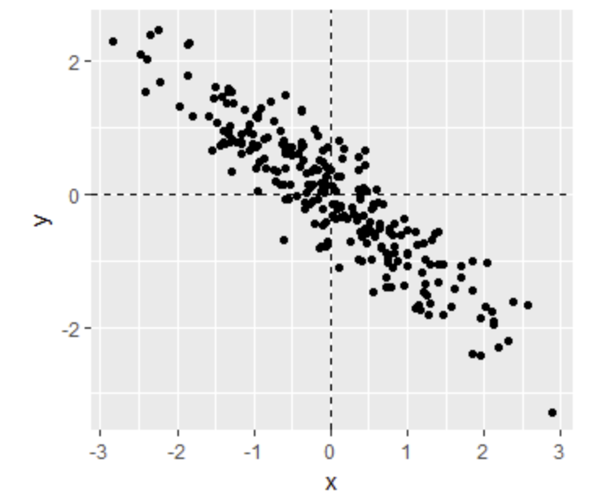

```{r setup, include=FALSE}
knitr::opts_chunk$set(echo = TRUE)
```

<br/>

## **Motivating Example: Moneyball**
### **Question 1**

What is the application of statistics and data science to baseball called?

- Moneyball
- Sabermetrics [X]
- The “Oakland A’s Approach”
- There is no specific name for this; it’s just data science.

<br/>

## **Baseball Basics**
### **Question 1**

Which of the following outcomes is not included in the batting average?

- A home run
- A base on balls [X]
- An out
- A single

<br/>

### **Question 2**

Why do we consider team statistics as well as individual player statistics?

- The success of any individual player also depends on the strength of their team. [X]
- Team statistics can be easier to calculate.
- The ultimate goal of sabermetrics is to rank teams, not players.

<br/>

## **Bases on Balls or Stolen Bases?**
### **Question 1**

You want to know whether teams with more at-bats per game have more runs per game. What R code below correctly makes a scatter plot for this relationship?

```
Teams %>% filter(yearID %in% 1961:2001 ) %>%
    ggplot(aes(AB, R)) + 
    geom_point(alpha = 0.5)
```
```
Teams %>% filter(yearID %in% 1961:2001 ) %>%
    mutate(AB_per_game = AB/G, R_per_game = R/G) %>%
    ggplot(aes(AB_per_game, R_per_game)) + 
    geom_point(alpha = 0.5) [X]
```
```
Teams %>% filter(yearID %in% 1961:2001 ) %>%
    mutate(AB_per_game = AB/G, R_per_game = R/G) %>%
    ggplot(aes(AB_per_game, R_per_game)) + 
    geom_line()
```
```
Teams %>% filter(yearID %in% 1961:2001 ) %>%
    mutate(AB_per_game = AB/G, R_per_game = R/G) %>%
    ggplot(aes(R_per_game, AB_per_game)) + 
    geom_point()
```

<br/>

### **Question 2**

What does the variable “SOA” stand for in the Teams table?

- sacrifice out
- slides or attempts
- strikeouts by pitchers [X]
- accumulated singles

<br/>

## **Correlation**
### **Question 1**

While studying heredity, Francis Galton developed what important statistical concept?

- Standard deviation
- Normal distribution
- Correlation [X]
- Probability

<br/>

### **Question 2**

The correlation coefficient is a summary of what?

- The trend between two variables [X]
- The dispersion of a variable
- The central tendency of a variable
- The distribution of a variable

<br/>

## **Correlation Coefficient**
### **Question 1**

Below is a scatter plot showing the relationship between two variables, x and y.



From this figure, the correlation between x and y appears to be about:

- -0.9 [X]
- -0.2
- 0.9
- 2

<br/>

## **Sample Correlation is a Random Variable**
### **Question 1**
1/1 point (graded)
Instead of running a Monte Carlo simulation with a sample size of 25 from our 179 father-son pairs, we now run our simulation with a sample size of 50.

Would you expect the mean of our sample correlation to increase, decrease, or stay approximately the same?

- Increase
- Decrease
- Stay approximately the same [X]

<br/>

### **Question 2**

Instead of running a Monte Carlo simulation with a sample size of 25 from our 179 father-son pairs, we now run our simulation with a sample size of 50.

Would you expect the standard deviation of our sample correlation to increase, decrease, or stay approximately the same?

- Increase
- Decrease [X]
- Stay approximately the same

Anscombe's Quartet/Stratification
Question 1

Look at the figure below. The slope of the regression line in this figure is equal to what, in words?

scatter plot of son and father heights with son heights on the y-axis and father heights on the x-axis

- Slope = (correlation coefficient of son and father heights) * (standard deviation of sons’ heights / standard deviation of fathers’ heights) [X]
- Slope = (correlation coefficient of son and father heights) * (standard deviation of fathers’ heights / standard deviation of sons’ heights)
- Slope = (correlation coefficient of son and father heights) / (standard deviation of sons’ heights * standard deviation of fathers’ heights)
- Slope = (mean height of fathers) - (correlation coefficient of son and father heights * mean height of sons).

<br/>

### **Question 2**

Why does the regression line simplify to a line with intercept zero and slope  when we standardize our x and y variables? Try the simplification on your own first!

- When we standardize variables, both x and y will have a mean of one and a standard deviation of zero. When you substitute this into the formula for the regression line, the terms cancel out until we have the following equation: $\ y_i = px_i$.
- When we standardize variables, both x and y will have a mean of zero and a standard deviation of one. When you substitute this into the formula for the regression line, the terms cancel out until we have the following equation: $\ y_i = px_i$.
- When we standardize variables, both x and y will have a mean of zero and a standard deviation of one. When you substitute this into the formula for the regression line, the terms cancel out until we have the following equation: $\ y_i = px_i$.

<br/>

### **Question 3**

What is a limitation of calculating conditional means?

- Each stratum we condition on (e.g., a specific father’s height) may not have many data points. [X]
- Because there are limited data points for each stratum, our average values have large standard errors. [X]
- Conditional means are less stable than a regression line. [X]
- Conditional means are a useful theoretical tool but cannot be calculated.

<br/>

## **Bivariate Normal Distribution**
### **Question 1**

A regression line is the best prediction of Y given we know the value of X when:

- X and Y follow a bivariate normal distribution. [X]
- Both X and Y are normally distributed.
- Both X and Y have been standardized. incorrect
- There are at least 25 X-Y pairs.

<br/>

### **Question 2**

Which one of the following scatterplots depicts an x and y distribution that is NOT well-approximated by the bivariate normal distribution?

- scatter plot with v-shaped distribution of points centered on zero [X]
- scatter plot with rising slope and a roughly oval shaped distribution
- scatter plot with slope of approximately zero and a very round oval shaped distribution
- scatter plot with negative slope and a very long, tight oval shaped distribution of points

<br/>

## **Variance Explained**
### **Question 1**

We previously calculated that the correlation coefficient  between fathers’ and sons’ heights is 0.5.

Given this, what percent of the variation in sons’ heights is explained by fathers’ heights?

- 0%
- 25% [X]
- 50%
- 75%
